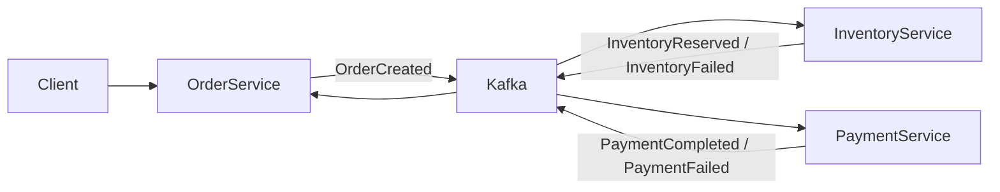
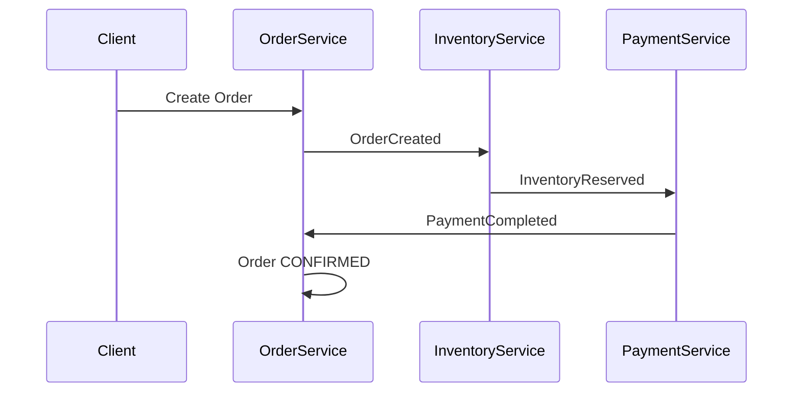
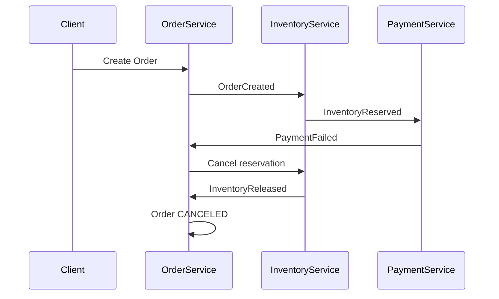
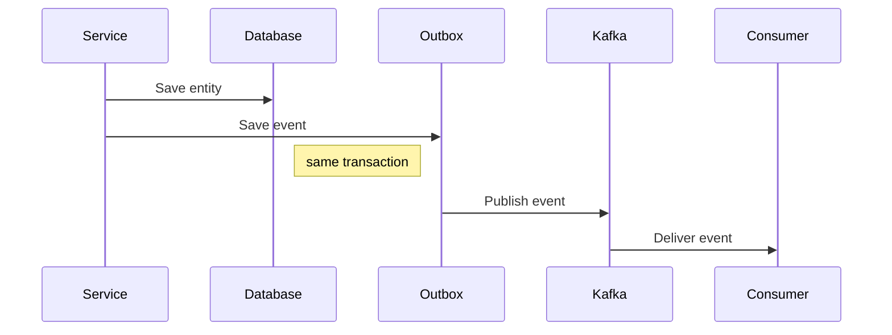

# OMS Microservices

Event-driven Order Management System built with **Spring Boot, Kafka and PostgreSQL**.

The project demonstrates how microservices can communicate reliably using **Saga orchestration** and the **Outbox pattern**.

Each service owns its own database and communicates asynchronously via Kafka events.

---

# Architecture



The system uses **event-driven communication** between services.

---

# Event Flow

Successful order processing:



Failure scenario:



---

# Outbox Pattern

To guarantee reliable event delivery, each service uses the **Outbox pattern**.



This guarantees **at-least-once delivery** of events.

---

# Services

## Order Service

Handles order lifecycle.

Responsibilities:

* create orders
* publish `OrderCreated` events
* react to payment events
* manage order status

Port:

```
8080
```

---

## Inventory Service

Handles product stock reservation.

Responsibilities:

* reserve inventory
* release inventory on payment failure
* publish inventory events

Events produced:

```
InventoryReserved
InventoryFailed
InventoryReleased
```

Port:

```
8081
```

---

## Payment Service

Simulates payment processing.

Responsibilities:

* process payments
* randomly succeed or fail
* publish payment events

Events produced:

```
PaymentCompleted
PaymentFailed
```

Port:

```
8082
```

---

# Architecture Patterns

This project demonstrates several distributed system patterns:

* Microservice architecture
* Event-driven communication
* Saga orchestration
* Outbox pattern
* Idempotent event processing
* Integration testing with Testcontainers

---

# Project Structure

```
oms-microservices
│
├ docker-compose.yml
│
├ order-service
│
├ inventory-service
│
└ payment-service
```

Each service follows a layered architecture:

```
api
application
domain
events
infrastructure
```

---

# Running the System

## 1 Start infrastructure

```bash
docker compose up -d
```

This will start:

* PostgreSQL
* Kafka

---

## 2 Run services

Start the applications from your IDE:

```
OrderServiceApplication
InventoryServiceApplication
PaymentServiceApplication
```

---

## 3 Create an order

```
POST http://localhost:8080/orders
```

Example request body:

```json
{
  "userId": "11111111-1111-1111-1111-111111111111",
  "items": [
    {
      "productId": "aaaaaaaa-aaaa-aaaa-aaaa-aaaaaaaaaaaa",
      "quantity": 2,
      "price": 50
    }
  ]
}
```

---

# Tech Stack

* Java 17
* Spring Boot
* Spring Kafka
* PostgreSQL
* Flyway
* Docker
* Testcontainers
