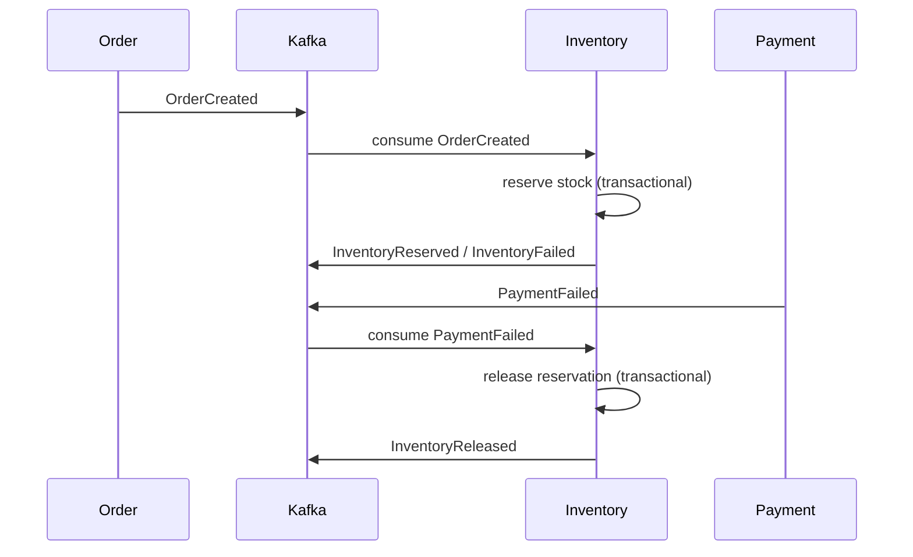

# Inventory Service – Event-Driven Saga Participant

## Overview

The **Inventory Service** is a core component of the Order Management System (OMS).  
It participates in a choreography-based Saga and is responsible for reserving and releasing product stock in response to domain events.

The service guarantees:

- Atomic stock reservation
- Compensation handling
- Idempotent event processing
- Reliable event publication via the Outbox pattern

It is designed as a fully event-driven microservice.

---

## Architectural Context

The system follows the **Saga pattern (choreography style)**.

Inventory Service reacts to domain events published by other services and emits its own events to continue the distributed workflow.

### Event Flow



The service does not coordinate the Saga.  
Instead, it reacts to events and publishes new events.

---

## Responsibilities

### Consumed Events

- `OrderCreated`
- `PaymentFailed`

### Produced Events

- `InventoryReserved`
- `InventoryFailed`
- `InventoryReleased`

---

## Consistency & Reliability Guarantees

### Transactional Boundaries

All state changes are performed inside a single database transaction:

- Inventory update
- Reservation creation
- Outbox event write

This ensures atomic state transitions.

---

### Outbox Pattern

Events are not published directly to Kafka.

Instead:

1. Domain state is modified
2. Event is written to `outbox_events` table
3. A publisher asynchronously sends events to Kafka

This guarantees:

- No lost messages
- No dual-write problem
- Reliable event delivery

---

### Idempotency

The service handles at-least-once delivery semantics.

A `processed_events` table ensures that duplicate events are ignored.

If the same `OrderCreated` event is delivered multiple times:

- Stock is reserved only once
- No duplicate reservations are created
- No duplicate outbox events are produced

---

### Failure Safety

If stock is insufficient:

- No partial updates occur
- No reservation is created
- An `InventoryFailed` event is published

On `PaymentFailed`, previously reserved stock is released.

---

## Data Model

### `inventory_items`
Stores available and reserved quantities.

### `inventory_reservations`
Tracks reservations per order.

### `processed_events`
Ensures idempotent processing of incoming events.

### `outbox_events`
Stores events to be published to Kafka.

---

## Key Design Decisions

### Why Saga (Choreography)?

- Loose coupling between services
- No central orchestrator
- Natural event-driven flow

---

### Why Outbox Instead of Direct Kafka Publish?

To avoid the dual-write problem.

If a DB update succeeds but Kafka publish fails (or vice versa), the system becomes inconsistent.

Outbox ensures atomicity between state change and event emission.

---

### Why Manual JSON Deserialization?

The service consumes multiple event types from different topics.

Using `StringDeserializer` with explicit `ObjectMapper` gives:

- Full control
- Clear error handling
- No hidden type mapping

---

### Why Testcontainers?

Integration tests run against:

- Real PostgreSQL
- Real Kafka broker

This validates:

- Transaction boundaries
- Async processing
- Outbox publishing
- Idempotency under real broker conditions

---

## Testing Strategy

### Service-Level Integration Tests

- Reservation logic
- Compensation logic
- Transactional behavior

Runs against real PostgreSQL using Testcontainers.

---

### Kafka End-to-End Tests

- OrderCreated → Reservation
- PaymentFailed → Release
- Insufficient stock → InventoryFailed
- Duplicate OrderCreated → Idempotent handling

KafkaContainer is used to validate full event-driven flow.

---

## Running the Service

### Requirements

- Docker
- Java 17+
- Maven Wrapper

### Start Infrastructure

```bash
docker-compose up -d
```

### Run Service

```bash
./mvnw spring-boot:run
```

---

## Production Considerations

- Dead Letter Topic handling
- Metrics & monitoring
- Observability (OpenTelemetry)
- Stock locking strategies for high concurrency
- Contract testing between services
