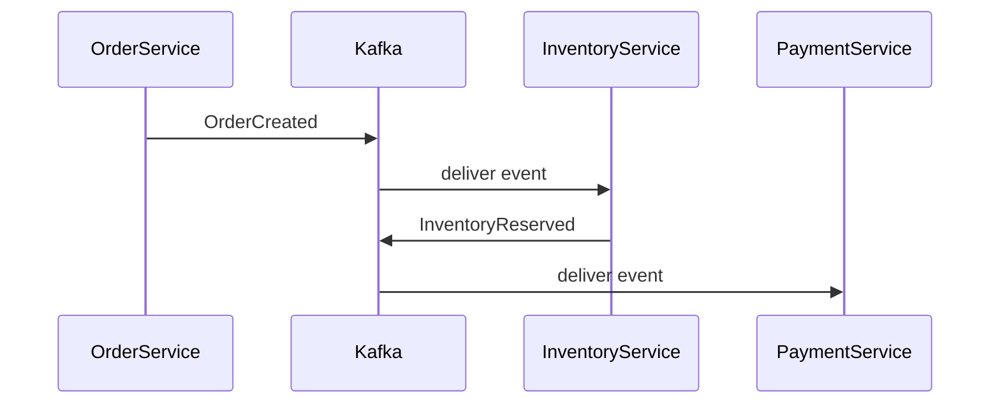
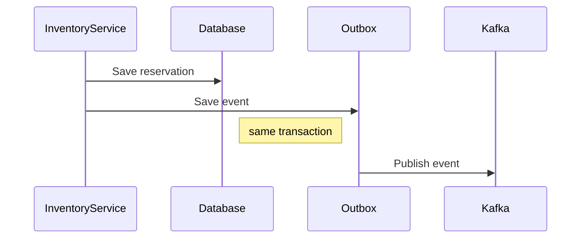

# Inventory Service

Inventory Service is responsible for managing product stock reservations.

The service listens for order creation events and attempts to reserve inventory for the requested products.

Communication between services is event-driven via Kafka.

---

# Responsibilities

* reserve product inventory
* release reservations when payment fails
* publish inventory events

---

# Consumed Events

```text
OrderCreated
PaymentFailed
```

`OrderCreated` triggers inventory reservation.

`PaymentFailed` triggers inventory release.

---

# Produced Events

```text
InventoryReserved
InventoryFailed
InventoryReleased
```

These events inform other services about the inventory state.

---

# Event Flow


```mermaid
sequenceDiagram

participant OrderService
participant Kafka
participant InventoryService
participant PaymentService

OrderService->>Kafka: OrderCreated
Kafka->>InventoryService: deliver event

InventoryService->>Kafka: InventoryReserved
Kafka->>PaymentService: deliver event
```

---

# Outbox Pattern

Inventory Service publishes events using the Outbox pattern.


```mermaid
sequenceDiagram

participant InventoryService
participant Database
participant Outbox
participant Kafka

InventoryService->>Database: Save reservation
InventoryService->>Outbox: Save event
Note right of Database: same transaction

Outbox->>Kafka: Publish event
```

---

# Service Port

```
8081
```

---

# Tech Stack

* Java 17
* Spring Boot
* Spring Kafka
* PostgreSQL
* Flyway
