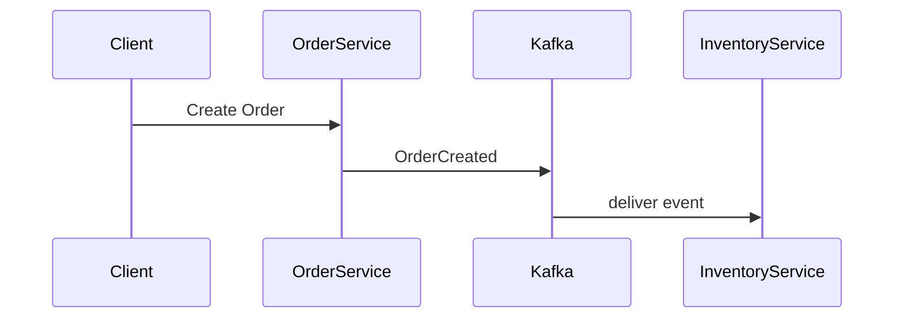
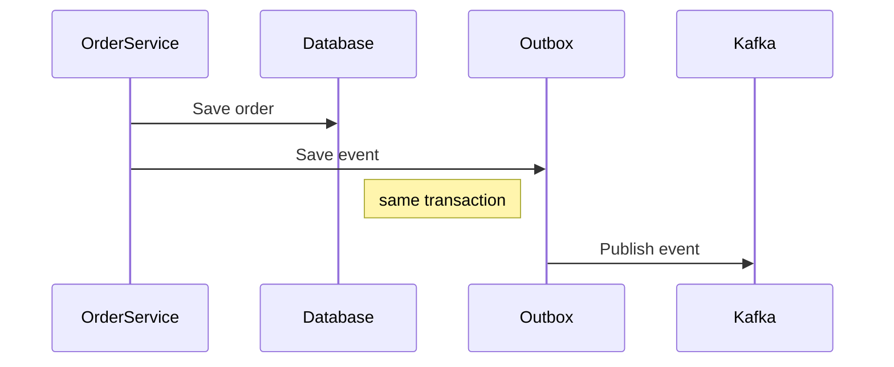

# Order Service

Order Service is responsible for managing the lifecycle of orders.

The service exposes an HTTP API for creating orders and coordinates the order processing workflow using events from other services.

Communication between services is asynchronous and implemented via Kafka.

---

# Responsibilities

* create orders
* publish `OrderCreated` events
* react to payment events
* update order status

---

# Consumed Events

```text
PaymentCompleted
PaymentFailed
```

These events determine the final state of an order.

---

# Produced Events

```text
OrderCreated
```

Published when a new order is created.

---

# Event Flow



---

# Outbox Pattern

Order Service uses the Outbox pattern to guarantee reliable event publishing.



---

# Service Port

```
8080
```

---

# Tech Stack

* Java 17
* Spring Boot
* Spring Kafka
* PostgreSQL
* Flyway
