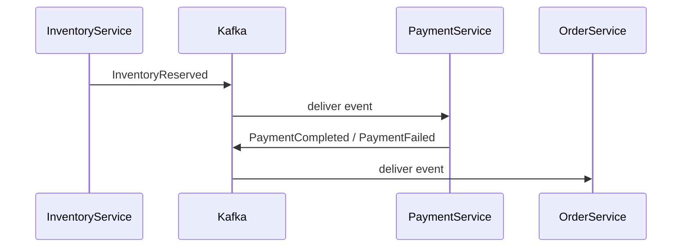
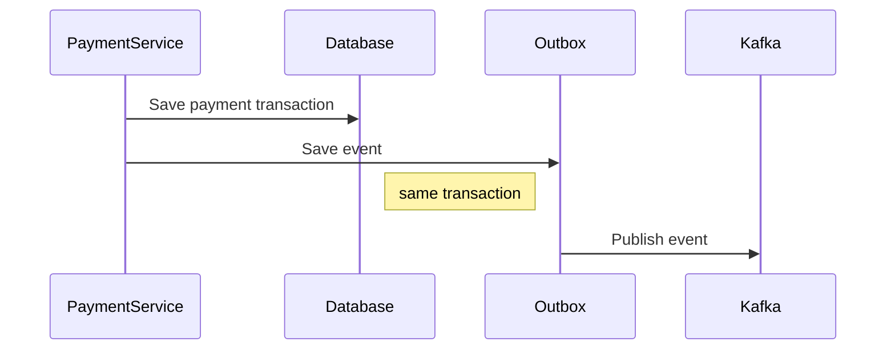

# Payment Service

Payment Service is responsible for processing payments for orders.

The service receives events from Inventory Service and determines whether the payment succeeds or fails.

Communication between services is asynchronous via Kafka.

---

# Responsibilities

* process payments
* simulate payment success or failure
* publish payment result events

---

# Consumed Events

```text
InventoryReserved
```

Triggered when inventory has been successfully reserved.

---

# Produced Events

```text
PaymentCompleted
PaymentFailed
```

These events inform the Order Service about the payment result.

---

# Event Flow



---

# Outbox Pattern

Payment Service uses the Outbox pattern for reliable event publishing.



---

# Service Port

```
8082
```

---

# Tech Stack

* Java 17
* Spring Boot
* Spring Kafka
* PostgreSQL
* Flyway
